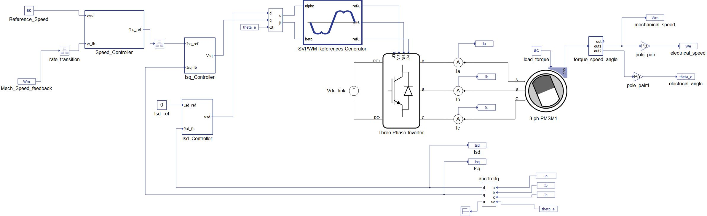
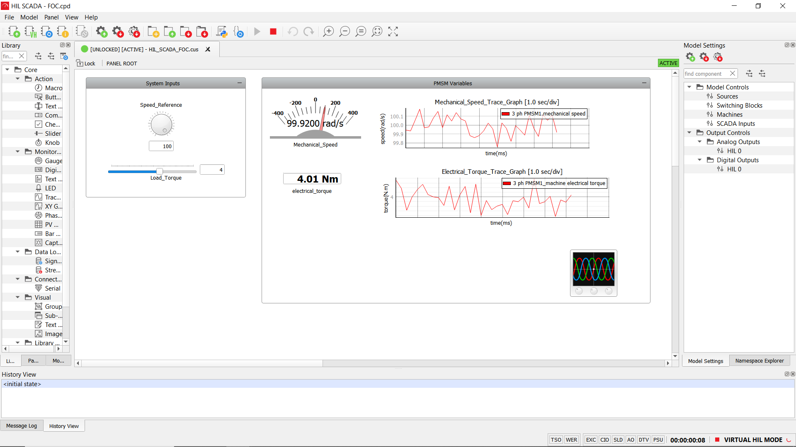
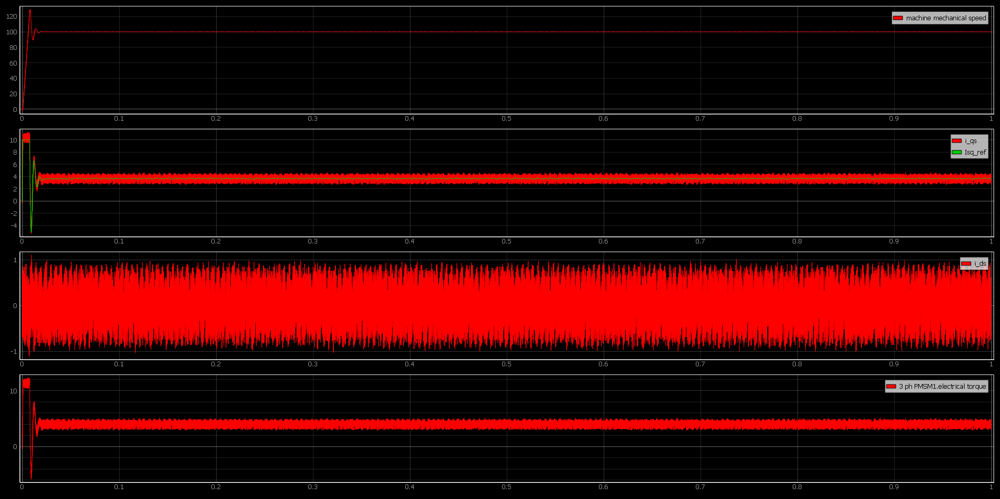

# Simulation of an FOC of a PMSM's speed in Typhoon HIL CCS

## DESCRIPTION

A detailed description of the FOC architecture, the mathematical model of the PMSM, and the controller parameter selection techniques can be found in the **`FOC_PMSM.pdf`** file. 

The controllers are PI controllers and the parameter selection techniques used are the absolute value optimum for the current controllers' parameters, and the symmetric optimum for the speed controller parameters. **The parameter selection code and PMSM parameters can be found in the **`FOC_Params.py`** file** which is written in Python. These techniques and FOC architecture are based on the work done in [1][2]. Also, I included an anti-windup (using back-calculation) in the speed controller.

Furthermore, this simulation is done using the Typhoon HIL CCS--a hardware-in-the-loop testing platform/software--in the virtual HIL mode. Typhoon HIL CCS provides a Python-based API called the HIL API that allows users to control the simulation process from Python scripts. The schematic diagram for this project is shown in the figure below  

## HOW TO USE THE APPLICATIONS IN TYPHOON HIL

1. Once you have the Typhoon HIL CCS installed, download and open the **`FOC.tse`** file
2. Navigate to the menu bar and select the **`Compile and (re)load Model in HIL SCADA`** button. This will open the HIL SCADA application
3. Once the model has been compiled and the HIL SCADA application is opened, select the **`Open Panel`** button. Then navigate to where the **`HIL_SCADA_FOC.cus`** file and located and open it.
4. Once the panel is opened, you can then start the simulation

## SAMPLE RESULTS
The HIL SCADA panel diagram is shown in the figure below for a speed reference of $100rad/s$ and $4N.m$. 

 

The Scope's capture at the initial $1ms$ is shown below

 

## References
1. B. Zigmund, A. Terlizzi, X.T. Garcia, R. Pavlanin and L.Salvatore, Experimental evaluation of PI tuning techniques for field-oriented control of permanent magnet synchronous motors, Advances in Electrical and Electronic Engineering, 14, 114-119.
2. Umland, J. W., & Safiuddin, M. (n.d.). Magnitude and symmetric optimum criterion for the design of linear control systems-what is it and does it compare with the others? Conference Record of the 1988 IEEE Industry Applications Society Annual Meeting. doi:10.1109/ias.1988.25302 

